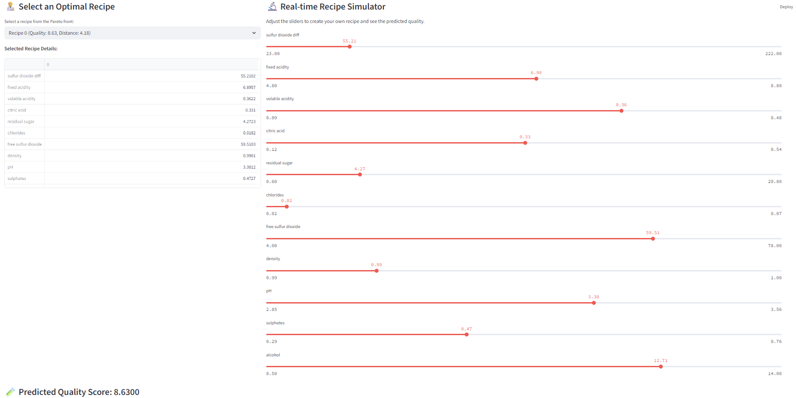

# Recipe-Optimize

## 프로젝트 개요

이 프로젝트는 머신러닝을 활용하여 레시피를 최적화하는 것을 목표로 합니다. 데이터 분석, 머신러닝 모델 개발, 레시피 시뮬레이션 및 최적화, 그리고 결과를 시각화하는 대시보드 기능을 포함합니다.



## 주요 기능

-   **데이터 탐색 및 분석 (EDA)**: 제공된 데이터를 기반으로 레시피 관련 특성을 분석합니다.
-   **머신러닝 모델 개발**: 레시피의 특정 속성(예: 와인 품질)을 예측하거나 최적화하기 위한 머신러닝 모델을 훈련합니다.
-   **레시피 시뮬레이션**: 다양한 레시피 조합을 시뮬레이션하여 최적의 레시피를 탐색합니다.
-   **최적 레시피 저장**: 시뮬레이션 및 최적화 과정을 통해 발견된 최적의 레시피를 저장합니다.
-   **대시보드**: 최적화된 레시피를 시각적으로 탐색하고 상호작용할 수 있는 웹 기반 대시보드를 제공합니다.

## 프로젝트 구조

```
Recipe-Optimize/
├── data/                     # 원본 및 전처리된 데이터 파일
│   ├── cleaned.csv
│   ├── winequality-red.csv
│   └── winequality-white.csv
├── recipe/                   # Python 가상 환경 (또는 Conda 환경) 관련 파일
├── 01.EDA.ipynb              # 데이터 탐색 및 분석 Jupyter 노트북
├── 02.ML.ipynb               # 머신러닝 모델 개발 및 훈련 Jupyter 노트북
├── 02_ml_runner.py           # 머신러닝 모델 실행 또는 파이프라인 스크립트
├── 03_simulation_advanced.py # 레시피 최적화 시뮬레이션 스크립트
├── dashboard.py              # 대시보드 애플리케이션 스크립트
├── et_regressor_model.joblib # 훈련된 머신러닝 모델 파일
├── X_test.pkl                # 모델 테스트에 사용된 데이터
├── best_recipes.csv          # 최적화된 레시피 목록
├── best_recipes_fitness.csv  # 최적화된 레시피의 적합도 점수
├── shap_summary_plot.png     # SHAP 요약 플롯 이미지
└── README.md                 # 프로젝트 설명 파일
```

## 시작하기

### 1. 환경 설정

프로젝트를 실행하기 전에 필요한 의존성을 설치해야 합니다.

1.  **가상 환경 활성화**: (만약 `recipe/`가 가상 환경이라면)
    ```bash
    source recipe/bin/activate
    ```
    또는 Conda 환경이라면:
    ```bash
    conda activate recipe
    ```

2.  **의존성 설치**: 프로젝트에 필요한 Python 패키지들을 설치합니다. `requirements.txt` 파일이 없으므로, 필요한 패키지들을 수동으로 설치해야 할 수 있습니다. 일반적으로 다음과 같은 패키지들이 필요할 수 있습니다:
    *   `pandas`
    *   `numpy`
    *   `scikit-learn`
    *   `matplotlib`
    *   `seaborn`
    *   `jupyter` (노트북 실행용)
    *   `joblib`
    *   `shap`
    *   `streamlit` (대시보드용, `dashboard.py`가 Streamlit 기반일 경우)

    예시:
    ```bash
    pip install pandas numpy scikit-learn matplotlib seaborn jupyter joblib shap streamlit
    ```

### 2. 프로젝트 실행

각 스크립트의 목적에 따라 다음 명령어를 사용하여 프로젝트를 실행할 수 있습니다.

-   **데이터 탐색 및 머신러닝 모델 훈련**: Jupyter 노트북을 실행하여 데이터 분석 및 모델 훈련 과정을 따라갈 수 있습니다.
    ```bash
    jupyter notebook 01.EDA.ipynb
    jupyter notebook 02.ML.ipynb
    ```

-   **머신러닝 파이프라인 실행**: (모델 훈련 또는 예측 등)
    ```bash
    python 02_ml_runner.py
    ```

-   **레시피 시뮬레이션 실행**: 최적화된 레시피를 찾기 위한 시뮬레이션을 실행합니다.
    ```bash
    python 03_simulation_advanced.py
    ```

-   **대시보드 실행**: 최적화 결과를 시각적으로 확인하고 상호작용합니다. (`dashboard.py`가 Streamlit 기반이라고 가정)
    ```bash
    streamlit run dashboard.py
    ```
    (실행 후 웹 브라우저에서 제시된 URL로 접속)

## 기여

프로젝트에 기여하고 싶으시다면, 이슈를 생성하거나 풀 리퀘스트를 제출해 주세요.